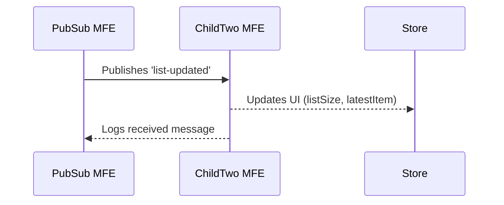

# 📦 Maya PubSub MFE

This is a demo of a **PubSub (Publish/Subscribe)** architecture built using **Maya**, a native micro front-end (MFE) framework. It showcases real-time MFE-to-MFE communication and reactive UI updates.

---

## 🧠 Maya Concepts Used

| Concept                      | Usage in This App                                                                 |
|------------------------------|-----------------------------------------------------------------------------------|
| `Maya.Store`                | Local store for each MFE managing scoped state (`pubsub`, `childtwo`)            |
| `Maya.Store.SetData`        | Updates state under the current MFE with `key`-scoped data (triggers re-render)  |
| `Maya.Store.Publish`        | Sends messages to subscribed MFEs via a `topic`                                  |
| `Maya.Store.Subscribe`      | Child MFE (`childtwo`) listens for messages on `list-updated`                    |
| `onLoad`                    | Lifecycle hook for initialization of data and subscriptions                      |
| `onMessage`                 | Message handler in `childtwo` that reacts to updates published by `pubsub`       |
| `MayaMFE`                   | Base class that all Maya MFEs inherit from                                       |
| `setStore`, `setView`, `setParent` | Core methods to bind MFE logic to store, view, and parent MFE                          |
| `window.customElements.define` | Registers MFE as a custom Web Component (`albert-pubsub`, `albert-childtwo`)         |

---

## 📁 File Structure

```
/mfe/pubsub/
  ├── /js/
  │   └── index.js         # Main logic, store, MFE declarations
  └── /view/
      ├── main.html        # Main view of the parent MFE
      └── childtwo.html    # View of the subscribing child MFE
```

---

## 🚀 Functionality Overview

### ✅ Features
- 📨 PubSub using `Maya.Store.Publish` / `Subscribe`
- 🧾 Log panel for debugging communication
- 📋 Live-updating item list
- 👶 Child MFE listens and reacts to messages
- 🔐 Stateless & secure view handling using lifecycle hooks

---

## 🔁 Data Flow



---

## 📦 Breakdown of MFEs

### 🔷 `pubsub` (Main MFE)

#### Store: `Maya.Store.pubsub`

- **Data:**  
  - `log`: Stores log lines (max 50).
  - `list`: Array of items.
  - `headers`: Column headers for UI.

- **Events:**
  - `initializeList`: Sets up default data and broadcasts it.
  - `addItem`: Adds a new item and republishes the updated list.
  - `logMessage`: Appends a log entry with a timestamp.

#### MFE Class: `MayaPubSub`

```js
window.customElements.define('albert-pubsub', MayaPubSub);
```

- **`onLoad`**: Calls `initializeList`
- **Uses**: `setStore`, `setView`, `getTitle`, `isSecured`

---

### 🟦 `childtwo` (Child MFE)

#### Store: `Maya.Store.childtwo`

- **Data:**
  - `listSize`: Current number of items.
  - `latestItem`: Most recent item added.

#### MFE Class: `ChildTwo`

```js
window.customElements.define('albert-childtwo', ChildTwo);
```

- **`onLoad`**:
  - Subscribes to topic `'list-updated'`
  - Pulls list from parent (if already available)
- **`onMessage`**:
  - Updates state with new item info
  - Logs message to main `pubsub` log

---

## 🛠️ How to Extend

- 🔌 Add another child MFE subscribing to `list-updated`
- 🪝 Use `onUnload` to unsubscribe listeners
- 📨 Introduce more topics (`item-deleted`, `item-edited`)
- 📈 Use `onRender` to load nested MFEs or perform animations

---

## 🧪 Sample Publish Call

```js
Maya.Store.Publish({ topic: 'list-updated' })({
  list: [{ id: 1, name: 'Project Alpha' }],
  headers: ['id', 'name', 'description']
});
```

---

## 📎 Resources

- 📘 [Maya PubSub Guide](https://github.com/maya-dev-kit/mayadoc/blob/main/readme/maya-pubsub.md)
